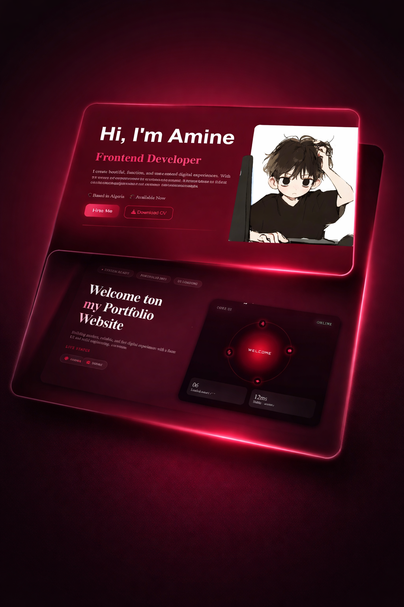

# Rahul Portfolio Showcase 💻

Welcome to Rahul's Portfolio Showcase!
A modern and elegant personal portfolio website built to present my projects, skills, and professional journey using HTML, CSS, and JS.
---

## Live Demo 🚀

You can view the live website here: [Live Demo](https://github.com/pranav-3010/Demo_portfolio)

---

## 🌟 Website Sections

- **Home**: Developer introduction with avatar and short description  
- **About**: Experience, tech stack, personal insights, and skill cards  
- **Projects**: Showcase of projects with images, descriptions, and skills  
- **Services**: Highlighting services offered with interactive cards  
- **Contact**: Contact form and social links with interactive hover effects  

---

## ⚡ Features

- Clean & modern UI design
- Smooth animations and transitions
- Fully responsive (Desktop / Tablet / Mobile)
- Interactive sections & hover effects
- Clean and organized code structure
- Fast performance & lightweight 

---

## 🛠 Technologies Used

- **HTML** – Structure and semantic content
- **CSS3** – Styling, responsive layouts, Flexbox & Grid 
- **JavaScript (Vanilla JS)** – Interactivity and animations
- **Font Awesome / Boxicons** – Icons
- **AOS.js** – Scroll animations

---

## 🚀 How to Use / Customize

1. **Clone the repository:**

```bash
git clone https://github.com/pranav-3010/Demo_portfolio.git
```

2. **Open the site:**

Open `porotofilo8/index.html` in your browser, or run a local server from the `porotofilo8` folder.

---

## 📬 Contact

- Email: balapranav3010@gmail.com
- GitHub: [github.com/pranav-3010](https://github.com/pranav-3010)
- LinkedIn: [linkedin.com/in/bala-pranav-72b9a83ab](https://www.linkedin.com/in/bala-pranav-72b9a83ab/)
- Instagram: [instagram.com/_pranavv18](https://www.instagram.com/_pranavv18)

---

Made with ❤️ by **Rahul**
